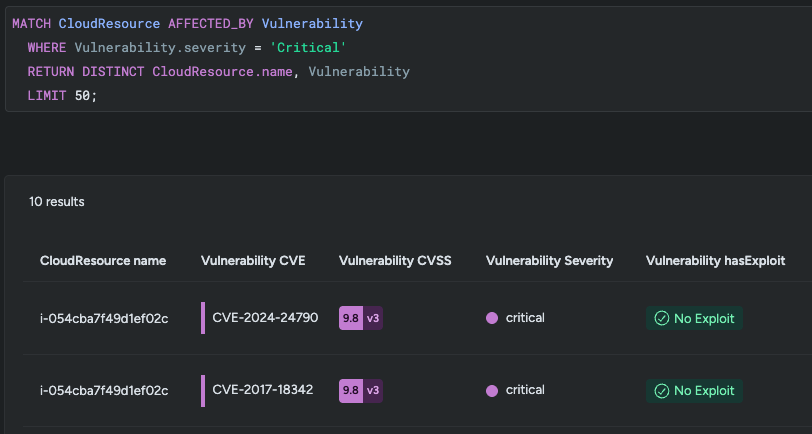
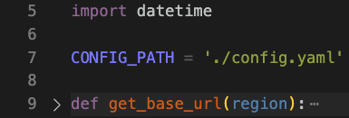
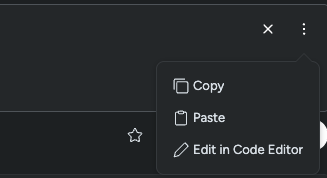
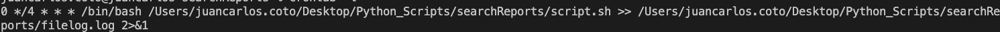

## Disclaimer

This script uses Sysdig internal APIs that are meant to be used on the platform, there is no guarantee they will continue to work or that they wont change without notice. 

## Guide

The Idea of this script is to automate the CSV generation from Sysql queries on the Search module. The steps of running it are very simple:



1- Edit the __config.ref.yaml__, add the required fields and rename to config.yaml:


__*The script assumes the config.yaml is on same folder, if not just change this line on the script__:




The sysql query will be specified in the same way as on the UI. If you used the query builder, make sure to click on _Edit in Code Editor_ to get the sysql representation




2-Install the requirements.txt file:

```
pip3 install -r requirements.txt
```

3-You can then run adhoc or in a crontab




If you want to know more about search, please visit the [Sysdig Search Docs](https://docs.sysdig.com/en/sysdig-secure/search/)
